# FitBites (食健计划)

  

> 健康饮食，营养规划，让生活更有味道

## 项目概述

FitBites（食健计划）是一个全面的家庭营养与膳食管理系统。"食"指美食，"健"强调健康，"计划"突出菜谱规划；英文名"FitBites"结合健康（fit）和餐食（bites），简短有力，适合关注营养的用户。

系统通过智能规划每周菜谱，帮助用户和家庭实现均衡营养摄入，同时考虑个人口味偏好和特殊饮食需求。FitBites不仅提供菜谱规划，还支持快速采购清单生成和烹饪流程优化，让健康饮食变得简单而愉悦。

## 核心功能

### 用户与家庭管理
- 多角色用户系统（普通用户、VIP用户、系统管理员）
- 家庭创建与成员管理（户主、副户主、成员）
- 个人营养偏好设置与人群标签管理

### 菜谱规划
- 智能周菜谱生成与管理
- 基于营养平衡的菜式推荐
- 家庭成员点菜功能
- 菜谱营养分析

### 烹饪辅助
- 餐次菜式展示
- 快速采购清单生成
- 智能烹饪流程整合
- 详细烹饪步骤指导

### 菜式管理
- 系统菜式库
- 家庭特色菜式
- 个人创建菜式
- 多维度菜式分类（菜系、烹饪方式、口味等）

### 系统管理
- 全面的字典表管理
- 用户与权限管理
- 食材与营养数据库维护

## 技术架构

### 开发环境
- 开发环境：macOS
- 部署环境：Linux (Docker)

### 后端技术
- 框架：.NET Core
- 架构模式：领域驱动设计 (DDD)
- 数据库：MySQL
- ORM：Entity Framework Core
- 认证：JWT (JSON Web Token)

### 前端技术
- 框架：Angular
- UI库：Angular Material
- 状态管理：NgRx

## 系统设计

### 实体关系图

```mermaid
classDiagram
    %% 基类
    class EntityBase {
        +Guid Id
        +DateTime CreatedAt
        +DateTime UpdatedAt
    }
    
    %% 用户和权限相关
    class User {
        +string UserCode
        +string Username
        +string Password
        +string Phone
        +string Nickname
        +string Avatar
        +UserStatus Status
    }
    
    class Role {
        +string RoleName
        +string RoleCode
        +string Description
    }
    
    class Permission {
        +string PermissionName
        +string PermissionCode
        +string Description
        +string Category
    }
    
    class UserRole {
        +Guid UserId
        +Guid RoleId
    }
    
    class PermissionMapping {
        +Guid RoleId
        +Guid PermissionId
    }
    
    class UserPreference {
        +Guid UserId
        +string PreferenceType
        +string PreferenceValue
    }
    
    %% 家庭相关
    class Family {
        +string FamilyCode
        +string FamilyName
        +Guid OwnerUserId
        +string Description
        +string Avatar
    }
    
    class FamilyMember {
        +Guid FamilyId
        +Guid UserId
        +FamilyMemberRole MemberRole
    }
    
    %% 食材相关
    class Ingredient {
        +string Name
        +string Category
        +string WaterContent
        +string FlavorProfile
        +string MainFunctions
        +string CookingBehavior
        +string PreferredUsage
        +bool? Volatile
        +string Notes
    }
    
    class IngredientNutrition {
        +Guid IngredientId
        +Guid NutritionDictId
        +decimal Content
        +string Unit
    }
    
    class IngredientNutritionDict {
        +string NutritionName
        +string Code
        +string DefaultUnit
        +string Category
    }
    
    class IngredientHumanGroup {
        +Guid IngredientId
        +Guid HumanGroupId
        +bool IsRecommended
        +string Reason
    }
    
    class IngredientPreprocess {
        +Guid IngredientId
        +string ProcessMethod
        +string Description
        +int SortOrder
    }
    
    class HumanGroupDict {
        +string GroupName
        +string GroupCode
        +string Description
        +string Category
    }
    
    class UserHumanGroup {
        +Guid UserId
        +Guid HumanGroupId
    }
    
    %% 菜式相关
    class Recipe {
        +string RecipeName
        +string ImageUrl
        +string Description
        +string CuisineType
        +string CookingMethod
        +string TasteProfile
        +string DifficultyLevel
        +int? PrepTime
        +int? CookTime
        +int? Servings
        +bool? Recommended
        +bool Status
        +RecipeSource Source
        +Guid? SourceId
    }
    
    class RecipeIngredient {
        +Guid RecipeId
        +Guid IngredientId
        +decimal Amount
        +string Unit
        +string ProcessMethod
        +string Note
        +int SortOrder
    }
    
    class RecipeCookingStep {
        +Guid RecipeId
        +int StepNumber
        +string Description
        +string ImageUrl
        +int? Duration
        +string TimingType
        +bool? NeedMonitor
    }
    
    %% 菜谱相关
    class WeeklyMealPlan {
        +string PlanCode
        +int Year
        +int WeekNumber
        +DateTime StartDate
        +DateTime EndDate
        +Guid? UserId
        +Guid? FamilyId
        +Guid CreatorUserId
        +string Description
        +MealPlanStatus Status
    }
    
    class MealPlanDetail {
        +Guid MealPlanId
        +int DayOfWeek
        +Guid MealTimeId
        +Guid RecipeId
        +int SortOrder
        +string Note
    }
    
    class MealPlanOrder {
        +Guid MealPlanId
        +Guid RecipeId
        +Guid UserId
        +int Score
        +string Comment
        +DateTime OrderTime
    }
    
    class MealPlanNutrition {
        +Guid MealPlanId
        +Guid NutritionDictId
        +decimal DailyAverage
        +string Unit
    }
    
    %% 字典表
    class MealTimeDict {
        +string MealTimeName
        +string Code
        +int SortOrder
    }
    
    class CuisineDict {
        +string CuisineName
        +string CuisineCode
        +string Region
    }
    
    class CookingMethodDict {
        +string MethodName
        +string MethodCode
        +string Description
    }
    
    class TasteDict {
        +string TasteName
        +string TasteCode
        +string Description
    }
    
    %% 继承关系
    EntityBase <|-- User
    EntityBase <|-- Role
    EntityBase <|-- Permission
    EntityBase <|-- UserRole
    EntityBase <|-- PermissionMapping
    EntityBase <|-- UserPreference
    EntityBase <|-- Family
    EntityBase <|-- FamilyMember
    EntityBase <|-- Ingredient
    EntityBase <|-- IngredientNutrition
    EntityBase <|-- IngredientNutritionDict
    EntityBase <|-- IngredientHumanGroup
    EntityBase <|-- IngredientPreprocess
    EntityBase <|-- HumanGroupDict
    EntityBase <|-- UserHumanGroup
    EntityBase <|-- Recipe
    EntityBase <|-- RecipeIngredient
    EntityBase <|-- RecipeCookingStep
    EntityBase <|-- WeeklyMealPlan
    EntityBase <|-- MealPlanDetail
    EntityBase <|-- MealPlanOrder
    EntityBase <|-- MealPlanNutrition
    EntityBase <|-- MealTimeDict
    EntityBase <|-- CuisineDict
    EntityBase <|-- CookingMethodDict
    EntityBase <|-- TasteDict
    
    %% 关联关系 - 用户和权限
    User "1" --o "多" UserRole : has
    Role "1" --o "多" UserRole : has
    Role "1" --o "多" PermissionMapping : has
    Permission "1" --o "多" PermissionMapping : has
    User "1" --o "多" UserPreference : has
    User "1" --o "多" UserHumanGroup : has
    HumanGroupDict "1" --o "多" UserHumanGroup : has
    
    %% 关联关系 - 家庭
    User "1" --o "多" Family : owns
    Family "1" --o "多" FamilyMember : has
    User "1" --o "多" FamilyMember : belongs to
    
    %% 关联关系 - 食材
    Ingredient "1" --o "多" IngredientNutrition : has
    IngredientNutritionDict "1" --o "多" IngredientNutrition : defines
    Ingredient "1" --o "多" IngredientHumanGroup : has
    HumanGroupDict "1" --o "多" IngredientHumanGroup : applies to
    Ingredient "1" --o "多" IngredientPreprocess : has
    Ingredient "1" --o "多" RecipeIngredient : used in
    
    %% 关联关系 - 菜式
    Recipe "1" --o "多" RecipeIngredient : contains
    Recipe "1" --o "多" RecipeCookingStep : has
    Recipe "1" --o "多" MealPlanDetail : included in
    Recipe "1" --o "多" MealPlanOrder : ordered in
    
    %% 关联关系 - 菜谱
    WeeklyMealPlan "1" --o "多" MealPlanDetail : contains
    WeeklyMealPlan "1" --o "多" MealPlanOrder : has
    WeeklyMealPlan "1" --o "多" MealPlanNutrition : has
    User "1" --o "多" WeeklyMealPlan : personal
    User "1" --o "多" WeeklyMealPlan : creates
    Family "1" --o "多" WeeklyMealPlan : has
    MealTimeDict "1" --o "多" MealPlanDetail : defines
    User "1" --o "多" MealPlanOrder : orders
    IngredientNutritionDict "1" --o "多" MealPlanNutrition : defines
```

### 架构设计

## 领域驱动设计（DDD）架构

FitBites系统采用领域驱动设计（DDD）作为核心架构模式，通过将业务领域知识与技术实现紧密结合，打造一个真实反映营养与膳食管理领域本质的系统。

### DDD分层架构

1. **表示层（UI Layer）**：
   - 提供用户界面，处理用户交互
   - 包含API控制器，接收和响应HTTP请求
   - 负责数据的呈现和收集，但不包含业务逻辑

2. **应用层（Application Layer）**：
   - 作为领域层和表示层之间的桥梁
   - 协调和编排领域对象完成用户请求
   - 包含应用服务、DTO转换、命令处理器、事件处理器等
   - 不包含业务规则，只负责任务的编排

3. **领域层（Domain Layer）**：
   - 系统的核心，包含所有业务规则和领域逻辑
   - 定义实体、值对象、聚合根、领域服务和领域事件
   - 表达领域模型和业务规则，不依赖其他层

4. **基础设施层（Infrastructure Layer）**：
   - 提供技术实现，支持其他层
   - 实现持久化机制、外部服务集成、消息通信等
   - 包含仓储实现、工作单元、事件发布等

### 充血领域模型

FitBites系统采用充血模型设计领域对象，确保业务规则和行为直接封装在实体内部，而不仅仅是数据容器。

充血模型的特点：
- 实体不仅包含数据，还包含行为和业务规则
- 业务逻辑直接内嵌于领域对象中
- 通过方法实现状态变更，确保业务规则的执行
- 提高了代码的封装性和可维护性

例如，在User实体中：
- `VerifyPassword()`方法封装了密码验证逻辑
- `ChangePassword()`方法确保密码更新时自动加密
- `AddRole()`方法实现角色分配并触发相应领域事件

### 聚合与聚合根

系统围绕以下主要聚合进行设计，每个聚合有自己的边界和聚合根：

1. **用户聚合**：
   - 聚合根：`User`
   - 成员实体：`UserRole`、`UserPreference`、`UserHumanGroup`
   - 负责用户身份、权限、偏好和人群分类管理

2. **家庭聚合**：
   - 聚合根：`Family`
   - 成员实体：`FamilyMember`
   - 负责家庭信息和成员管理

3. **食材聚合**：
   - 聚合根：`Ingredient`
   - 成员实体：`IngredientNutrition`、`IngredientHumanGroup`、`IngredientPreprocess`
   - 负责食材基本信息、营养成分、适用人群和预处理方法管理

4. **菜式聚合**：
   - 聚合根：`Recipe`
   - 成员实体：`RecipeIngredient`、`RecipeCookingStep`
   - 负责菜式详情、配料和烹饪步骤管理

5. **菜谱聚合**：
   - 聚合根：`WeeklyMealPlan`
   - 成员实体：`MealPlanDetail`、`MealPlanOrder`、`MealPlanNutrition`
   - 负责周菜谱规划、餐次安排和营养分析管理

### 领域事件

系统实现了完整的领域事件机制，用于在领域操作后触发后续处理：

领域事件实现关键点：

1. **事件定义**：
   - 所有领域事件继承自`DomainEvent`基类
   - 每个事件包含必要的上下文信息
   - 事件命名遵循"实体名+动作+Event"模式

2. **事件发布**：
   - 聚合根通过`AddDomainEvent`方法添加领域事件
   - 工作单元在事务提交后负责收集和发布事件
   - 事件发布通过`IDomainEventPublisher`接口实现异步发布

3. **事件处理**：
   - 事件处理器实现`IDomainEventHandler<TEvent>`接口
   - 处理器通过依赖注入自动注册到系统
   - 每个事件可以有多个独立的处理器

4. **典型领域事件示例**：
   - `UserCreatedEvent`：用户创建后触发，用于初始化用户相关资源
   - `UserLoggedInEvent`：用户登录后触发，用于记录登录历史
   - `UserRoleAssignedEvent`：角色分配后触发，用于权限缓存更新
   - `MealPlanCreatedEvent`：菜谱创建后触发，用于执行营养分析
   - `RecipeCreatedEvent`：菜式创建后触发，用于相关推荐

### 值对象

系统中使用值对象表示没有唯一标识的概念：

1. **Address（地址）**：
   - 包含省份、城市、区县、详细地址、邮编等属性
   - 通过值相等而非引用相等进行比较
   - 不可变性，修改时创建新实例

2. **NutrientValue（营养成分值）**：
   - 包含数量和单位
   - 支持单位转换
   - 值相等比较

值对象的特点：
- 不可变性（Immutability）
- 无唯一标识
- 整体替换而非部分修改
- 通过属性值比较相等性

## 数据模型

系统包含丰富的数据实体，主要涵盖以下几个领域：

1. **用户与权限管理**：用户、角色、权限等
2. **家庭管理**：家庭、家庭成员等
3. **食材管理**：食材、营养成分、食材加工等
4. **菜式管理**：菜系、烹饪方式、口味、菜式详情等
5. **菜谱规划**：周菜谱、餐次、菜谱详情等

## 界面功能

### 基础界面
- 餐次界面：显示指定餐次所有菜式列表
- 快速买菜：显示指定餐次所有菜式的食材汇总
- 餐次烹饪：智能整合烹饪流程，提升效率
- 菜式界面：展示菜式详情、营养成分和制作步骤
- 菜谱菜式管理：周视图展示菜谱，支持动态调整

### 主要功能入口
- **当前餐次**：展示当前餐次菜式，快速跳转买菜和烹饪
- **查看菜谱**：管理所有菜谱，支持新菜谱生成
- **所有菜式**：浏览和管理系统、家庭和个人菜式
- **设置**：个人信息和家庭管理
- **系统管理**：管理员专用功能区

## 角色与权限

### 系统角色
- **系统管理员**：拥有所有权限
- **普通用户**：最多创建20个菜式，规划最近两周菜谱，仅能加入1个家庭
- **VIP用户**：最多创建50个菜式，规划最近两个月菜谱，可加入5个家庭

### 家庭角色
- **户主**：创建、编辑、查看家庭菜谱，调整菜谱菜式
- **副户主**：创建、编辑、查看家庭菜谱，调整菜谱菜式
- **成员**：查看家庭菜谱，参与点菜

## 开发与部署

### 环境要求
- .NET Core 9.0+
- MySQL 8.0+
- Node.js 16+
- Angular CLI

### 部署步骤
1. 克隆代码库
2. 后端配置与数据库迁移
3. 前端依赖安装与构建
4. Docker容器构建与部署

## 贡献指南

欢迎贡献代码或提出建议，请参考[贡献指南](CONTRIBUTING.md)。

## 许可证

本项目采用 [MIT 许可证](LICENSE)。

## 领域服务与应用服务

### 领域服务

领域服务用于处理不属于任何特定实体的领域逻辑，尤其是涉及多个聚合的复杂业务规则：

1. **MealPlanningService（菜谱规划服务）**：
   - 根据用户偏好和家庭成员组成生成智能周菜谱
   - 考虑营养均衡、口味偏好和季节性食材
   - 实现菜式多样性和合理搭配

2. **NutritionAnalysisService（营养分析服务）**：
   - 计算菜谱总体营养成分
   - 评估营养均衡性
   - 提供营养优化建议

3. **ShoppingListService（购物清单服务）**：
   - 汇总指定菜谱所需的所有食材
   - 合并相同食材并计算总量
   - 按食材类别和购买场所分类

4. **CookingProcessService（烹饪流程服务）**：
   - 整合多个菜式的烹饪步骤
   - 优化烹饪时序和资源利用
   - 生成高效烹饪流程

领域服务的特点：
- 无状态
- 处理跨实体业务逻辑
- 名称反映领域动作
- 参数和返回值为领域对象

### 应用服务

应用服务作为领域层和表示层之间的桥梁，协调各种领域对象完成用户请求：

1. **UserApplicationService**：
   - 用户注册、登录、资料管理
   - 角色和权限分配
   - 用户偏好设置

2. **FamilyApplicationService**：
   - 家庭创建和管理
   - 成员邀请和角色分配
   - 家庭偏好设置

3. **RecipeApplicationService**：
   - 菜式创建、查询和管理
   - 菜式评分和收藏
   - 菜式分类和标签管理

4. **MealPlanApplicationService**：
   - 菜谱创建和管理
   - 菜谱分享和复制
   - 菜谱推荐和点菜功能

应用服务的特点：
- 定义用例和应用操作
- 协调领域对象
- 不包含业务规则
- 处理事务边界
- 转换领域对象和DTO

## 系统实现总结

FitBites系统通过领域驱动设计（DDD）方法，实现了一个功能丰富、架构清晰的家庭营养与膳食管理系统。

### 关键实现要点

1. **充血模型的彻底应用**：
   - 业务规则直接封装在实体方法中
   - 实体方法名称反映领域语言
   - 通过实体方法强制执行业务约束

2. **聚合设计**：
   - 明确定义了5个核心聚合
   - 每个聚合边界清晰，责任单一
   - 聚合间通过ID引用，保持松耦合

3. **领域事件机制**：
   - 实现了完整的事件发布-订阅模式
   - 通过事件实现聚合间的间接通信
   - 支持系统扩展和功能解耦

4. **值对象应用**：
   - 使用值对象表达度量、坐标等概念
   - 确保值对象的不可变性
   - 通过值比较实现相等性判断

5. **仓储模式**：
   - 为每个聚合定义独立仓储
   - 实现统一的查询和持久化接口
   - 通过工作单元管理事务

6. **领域服务**：
   - 将跨实体的业务逻辑封装在领域服务中
   - 服务命名反映领域动作和意图
   - 保持服务的无状态特性

### 技术亮点

1. **事件驱动架构**：通过领域事件实现系统组件间的松耦合，提高系统可扩展性。

2. **代码即文档**：领域模型直接反映业务概念，使代码本身成为业务文档。

3. **统一语言**：开发团队和业务专家使用相同的领域语言，减少沟通成本。

4. **测试友好**：领域逻辑集中在实体和领域服务中，便于单元测试。

5. **高内聚低耦合**：聚合提供明确的边界，减少系统组件间的依赖。

### 持续演进

FitBites系统设计支持业务需求的持续演进：

1. **新增聚合**：可以方便地添加新的领域概念，如食谱分享、社交功能等。

2. **聚合扩展**：现有聚合可以在不影响其他部分的情况下扩展功能。

3. **事件订阅**：新功能可以通过订阅已有领域事件快速集成。

4. **微服务拆分**：清晰的聚合边界为未来可能的微服务拆分奠定基础。

5. **扩展点**：系统预留了多个扩展点，支持插件式功能增强。

通过领域驱动设计方法，FitBites不仅实现了当前的业务需求，还建立了一个可持续发展、易于维护和扩展的系统架构，为未来的功能迭代和业务增长提供了坚实基础。 