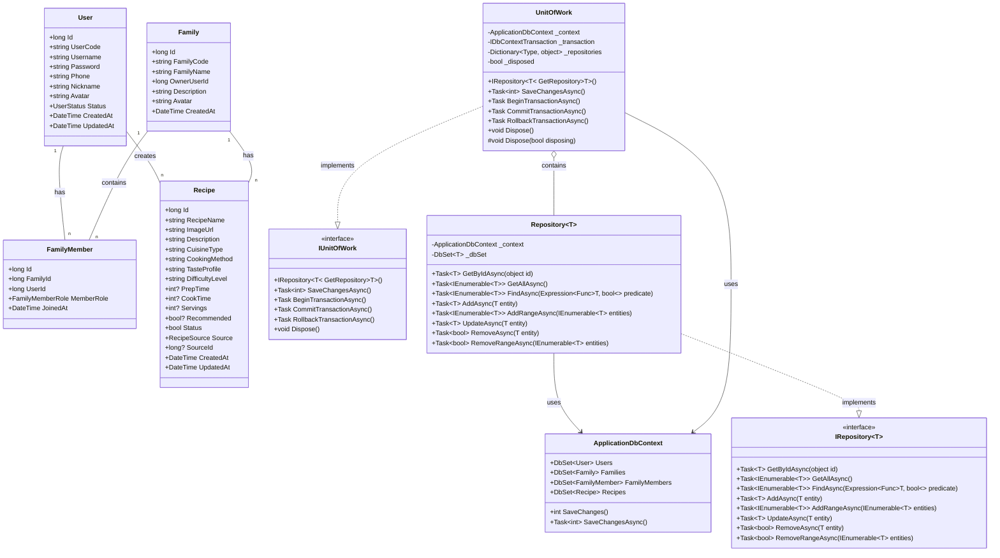

# FitBites 系统类图设计

## 实体关系图

## 实体关系说明

### 实体模型

1. **User (用户)**
   - 系统中的用户实体
   - 包含用户基本信息：用户名、密码、手机号等
   - 支持用户状态管理

2. **Family (家庭)**
   - 代表一个家庭单位
   - 每个家庭有一个户主(OwnerUserId)
   - 包含家庭的基本信息

3. **FamilyMember (家庭成员)**
   - 用户与家庭的关联实体
   - 记录用户在家庭中的角色(户主/副户主/成员)
   - 记录用户加入家庭的时间

4. **Recipe (菜式)**
   - 菜式信息实体
   - 包含菜式的详细信息：名称、图片、烹饪方式等
   - 记录菜式的来源(系统/家庭/用户)

### 仓储与工作单元模式

1. **IRepository<T> (仓储接口)**
   - 通用仓储接口，提供实体的基本CRUD操作
   - 支持异步操作

2. **Repository<T> (仓储实现)**
   - 通用仓储接口的实现
   - 使用EF Core进行数据访问

3. **IUnitOfWork (工作单元接口)**
   - 工作单元接口，提供事务管理
   - 统一管理多个仓储

4. **UnitOfWork (工作单元实现)**
   - 工作单元接口的实现
   - 管理事务和资源释放

5. **ApplicationDbContext (数据库上下文)**
   - EF Core数据库上下文
   - 管理实体集合和数据库连接

### 关系说明

- 一个用户可以属于多个家庭(通过FamilyMember关联)
- 一个家庭包含多个成员(通过FamilyMember关联)
- 用户可以创建多个菜式
- 家庭可以拥有多个菜式
- Repository依赖于ApplicationDbContext进行数据访问
- UnitOfWork实现了IUnitOfWork接口
- Repository实现了IRepository接口
- UnitOfWork包含并管理多个Repository实例 