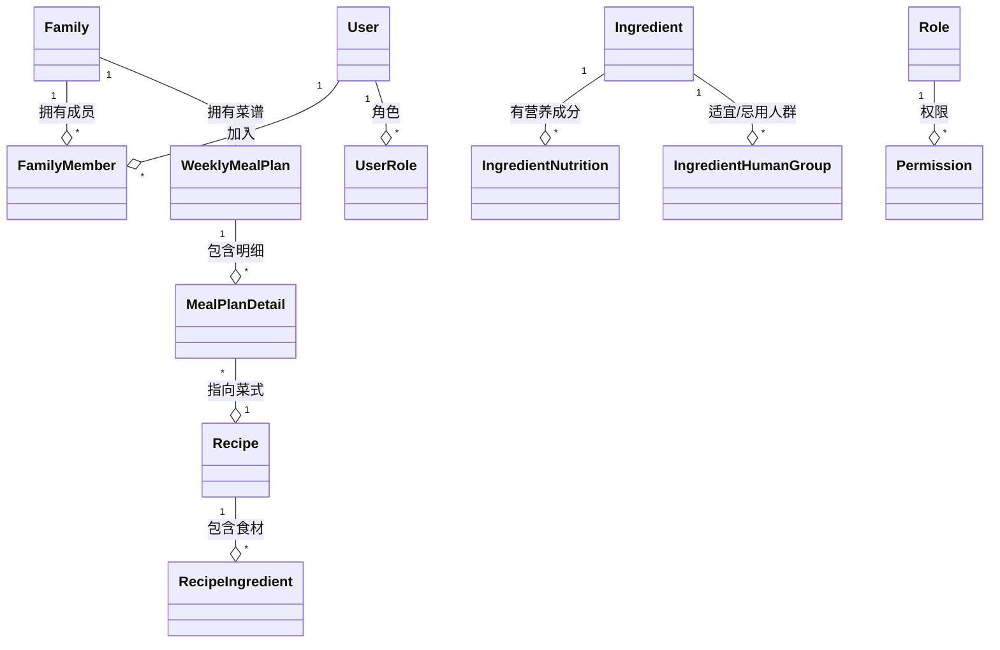

# FitBites 后台管理系统详细开发计划

## 1. 功能点与接口映射表

| 功能模块         | 子功能/说明         | 现有控制器/接口         | 备注 |
|------------------|---------------------|-------------------------|------|
| 口味管理         | 增删改查            | PreferenceController    | type=口味 |
| 菜系管理         | 增删改查            | PreferenceController    | type=菜系 |
| 烹饪方式管理     | 增删改查            | PreferenceController    | type=烹饪方式 |
| 餐次管理         | 增删改查            | MealTimeDictController  |      |
| 营养成分管理     | 增删改查            | IngredientNutritionDictController | |
| 人群标签管理     | 增删改查            | HumanGroupDictController |     |
| 食材管理         | 增删改查            | IngredientController    |      |
|                  | 适宜/忌用人群标签   | IngredientController    | /humangroup |
|                  | 营养成分管理        | IngredientController    | /nutrition |
|                  | 预处理方法管理      | IngredientController    | /preprocess |
| 菜式管理         | 菜式增删改查        | RecipeController        |      |
|                  | 菜式食材管理        | RecipeIngredientController |   |
|                  | 烹饪步骤管理        | RecipeCookingStepController | |
| 菜谱管理         | 菜谱增删改查        | （需补充）              | 【补充】 |
|                  | 菜谱家庭信息展示    | （需补充）              | 【补充】 |
|                  | 菜谱明细展示        | （需补充）              | 【补充】 |
|                  | 菜谱营养成分汇总    | （需补充）              | 【补充】 |
|                  | 菜谱生成            | （需补充）              | 【补充】 |
| 用户管理         | 用户增删改查        | UserController          |      |
|                  | 权限管理            | （需补充）              | 【补充】 |
|                  | 所属家庭管理        | （需补充）              | 【补充】 |
| 角色管理         | 角色增删改查        | （需补充）              | 【补充】 |
|                  | 权限管理            | （需补充）              | 【补充】 |
| 权限管理         | 权限增删改查        | （需补充）              | 【补充】 |
| 家庭管理         | 家庭增删改查        | （需补充）              | 【补充】 |
|                  | 家庭用户管理        | （需补充）              | 【补充】 |

> 注：PreferenceController 通过 type 区分口味/菜系/烹饪方式等。

---

## 2. 需补充功能点与接口建议

### 2.1 家庭管理（【补充】）
- 家庭增删改查
- 家庭成员管理（添加/移除成员、角色分配）
- 家庭与用户、菜谱、菜式的关联
- 建议接口：
  - `FamilyController`
    - GET /api/families
    - POST /api/families
    - PUT /api/families/{id}
    - DELETE /api/families/{id}
    - GET /api/families/{id}/members
    - POST /api/families/{id}/members
    - DELETE /api/families/{id}/members/{userId}

### 2.2 角色与权限管理（【补充】）
- 角色增删改查、分配权限
- 权限增删改查
- 用户/家庭成员角色分配
- 建议接口：
  - `RoleController`
    - GET /api/roles
    - POST /api/roles
    - PUT /api/roles/{id}
    - DELETE /api/roles/{id}
    - GET /api/roles/{id}/permissions
    - POST /api/roles/{id}/permissions
  - `PermissionController`
    - GET /api/permissions
    - POST /api/permissions
    - PUT /api/permissions/{id}
    - DELETE /api/permissions/{id}

### 2.3 菜谱管理（【补充】）
- 菜谱增删改查（周菜谱、家庭菜谱、个人菜谱）
- 菜谱明细展示（每日/每餐菜式）
- 菜谱营养成分汇总
- 菜谱生成（自动推荐/AI生成，预留）
- 建议接口：
  - `MealPlanController`
    - GET /api/mealplans
    - POST /api/mealplans
    - PUT /api/mealplans/{id}
    - DELETE /api/mealplans/{id}
    - GET /api/mealplans/{id}/details
    - GET /api/mealplans/{id}/nutrition-summary
    - POST /api/mealplans/generate

### 2.4 用户-家庭-权限多级管理（【补充】）
- 用户加入/退出家庭
- 家庭成员角色分级（户主、副户主、普通成员）
- 用户在不同家庭下的权限隔离
- 建议接口：
  - `FamilyController`/`FamilyMemberController`
    - POST /api/families/{id}/join
    - POST /api/families/{id}/leave
    - PUT /api/families/{id}/members/{userId}/role

---

## 3. 主要实体关系简图

---

## 4. 迭代开发建议与优先级

### 第一阶段（基础数据与核心业务）
- 完善基础字典（口味、菜系、烹饪方式、餐次、营养成分、人群标签）
- 完善食材、菜式、菜谱（含明细、营养汇总）管理
- 用户管理、用户人群、用户偏好

### 第二阶段（家庭与权限体系）
- 家庭管理、家庭成员管理、家庭与菜谱/菜式关联
- 角色与权限管理、用户-家庭-权限多级隔离

### 第三阶段（智能与扩展）
- 菜谱自动生成/AI推荐
- 高级权限分级、操作日志、数据统计
- 多端适配、API安全加固

---

## 5. 备注与补充说明
- 本计划基于现有领域模型与API实现，所有【补充】功能需先补齐应用服务与API接口。
- 具体接口参数、DTO、权限校验等细节可在详细设计阶段补充。
- 实体关系图可根据实际变更同步维护。 